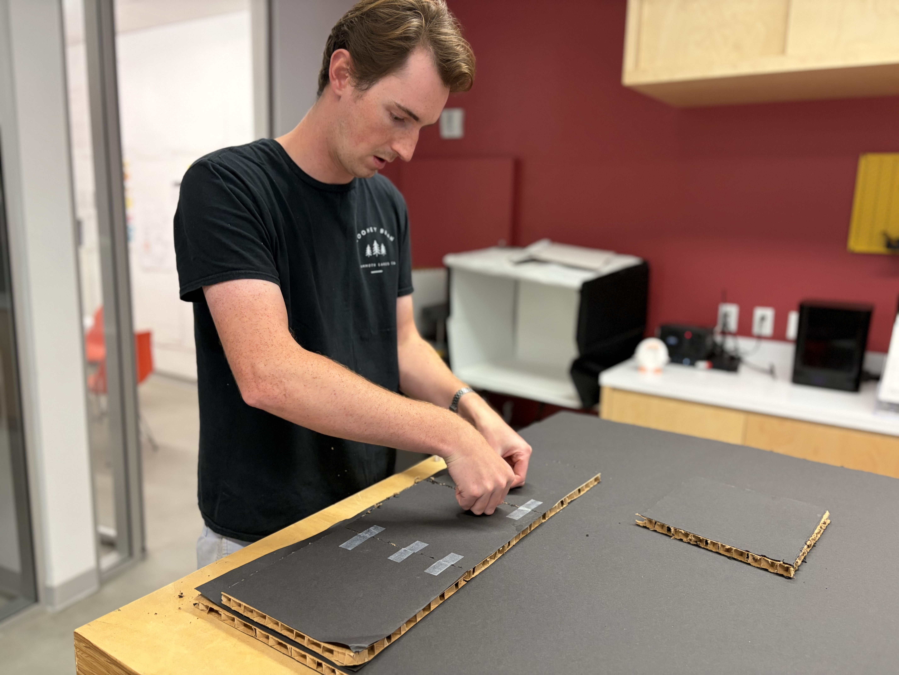
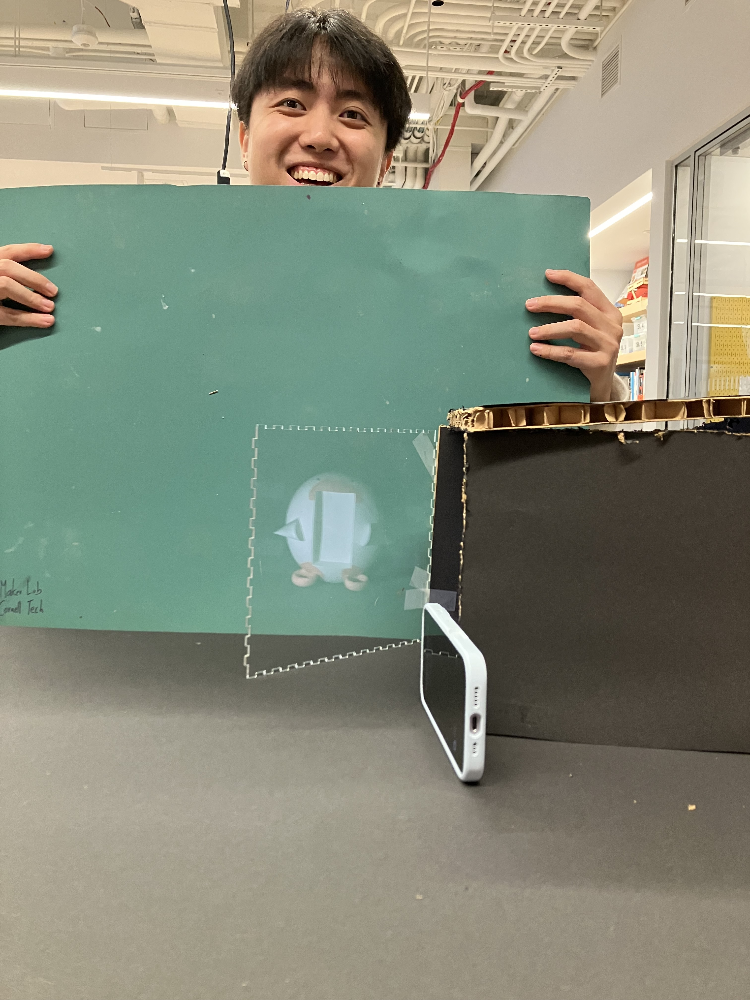
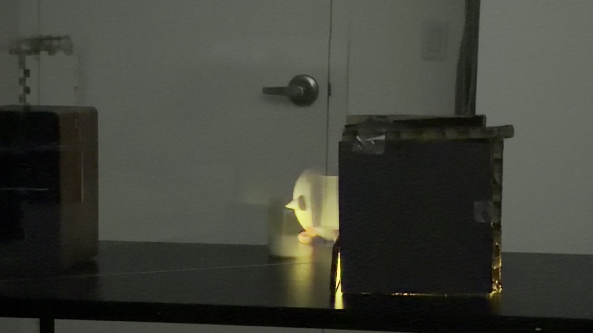
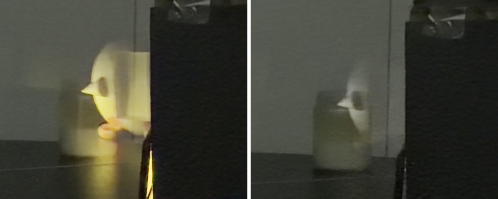

# Recreating the Masters of Interactive Light

_This project is to be done in teams of 2._

**COLLABORATORS:** Matthias Corkran, Xie Li

**THE MASTERWORK YOU DREW FROM THE HAT:** Pepper's Ghost

---

One way to understand greatness is to look to the greats. Just as painters learn
the technique and artistry of the old masters by recreating their paintings, so
too shall we come to understand computer-mediated interaction by recreating the
interactive masterworks of our time.

This week, every team will draw a different masterwork from a hat. Some are
conceptual pieces, some are historical works, some are modern-day products —
but they all share one thing: **their central mode of interaction is carried by
light.** Think of Tinker Bell in the original stage production of *Peter Pan*,
represented by nothing more than a darting circle of light from an off-stage
mirror. There was no actor playing Tinker Bell; she existed entirely through the
way the other characters interacted with that light.

Your job is to recreate the *interaction* of the piece you drew — not to build a
museum-grade replica, but to stage the moment that makes it what it is. Someone
who knows your piece should watch your recreation and recognize it instantly.
Someone who has never heard of it should walk away understanding what it is
famous for.

You will do this using the interaction staging techniques we will use all semester: a
storyboard, some acting, a phone standing in as a controllable light (the
*Tinkerbelle* tool), a hidden human "wizard" driving it, a costume, and a
recorded video.

*Make sure you read all the instructions and understand the whole activity
before starting!*

## Prep

To start, you will need:

1. Read about Git [here](https://git-scm.com/book/en/v2/Getting-Started-What-is-Git%3F).
2. Set up your own Github "Lab Hub" by forking the [Interactive-Lab-Hub repository](https://github.com/IRL-CT/Interactive-Lab-Hub). To get lab updates, simply use [GitHub's "Sync fork" button](https://docs.github.com/en/pull-requests/collaborating-with-pull-requests/working-with-forks/syncing-a-fork) when new content is available.

3. Set up your `README.md` so it has your name and links to this lab. Learn to
   format a README [here](https://docs.github.com/en/get-started/writing-on-github/getting-started-with-writing-and-formatting-on-github/basic-writing-and-formatting-syntax).
4. **Draw your masterwork from the hat and write it at the top of this file.**
   Whatever you drew is yours — lean into it.

## Materials

For this lab you will need:

1. Paper, markers/pens, scissors
2. A smartphone with a browser that can display a webpage (your stand-in "light")
3. A computer to host the control webpage
4. Found objects and materials to **costume your phone so it looks like the
   device in your masterwork** — doll clothes, a paper lantern, a bottle, foil,
   a cardboard shell, whatever it takes. Be resourceful.

## Deliverables

Submit all of the following in this lab folder of your Lab Hub, as links or
uploaded files. **Each group member posts their own copy to their own Github repo**, even if the work is
shared.

1. A short **research write-up** of your masterwork (what it is, when, who made
   it, and — most importantly — what the interaction is)
2. **3 iterated storyboards** of the interaction in the masterwork
5. A **video sketch** of your prototyped interaction
6. Any **reflections** on the process

Labs are due on Mondays. Make sure this page is linked from your main class hub
page.

---

# The Report

## Part 0. Know Your Master

Before you prototype anything, get intimately acquainted with the piece you
drew. Do real research. You are looking less for trivia than for the *shape of
the interaction*:

- What inputs are available to the user? What responses does the work give?
- Who is present, and how does the piece color the relationships between them?
- What is the piece famous for? What are its strengths and its weaknesses?

  Sometimes the details of how the interaction worked are lost in history. Try filling it in with your imagination!

**Describe your masterwork here, in your own words. What is the core interaction
someone would recognize it by?**

Our masterwork is **Pepper's Ghost**, the illusion John Henry Pepper premiered on
Christmas Eve 1862 at the Royal Polytechnic Institution on Regent Street, in a
staging of Charles Dickens' *The Haunted Man and the Ghost's Bargain*. The
optical trick itself is older — Giambattista della Porta described it in 1589,
and engineer Henry Dircks built a peepshow version that Pepper saw in 1862 —
but Pepper's contribution was the piece of stagecraft that made it work for a
paying audience: an angled sheet of plate glass across the proscenium plus a
hidden, brightly lit "blue room" below or beside the stage, so that "almost any
theatre or hall could make the illusion visible to a large audience." Pepper and
Dircks patented it jointly in 1863. It set off a craze for stage ghosts through
the 1860s and is still doing the same job today in Disney's Haunted Mansion
ballroom, in teleprompters, in heads-up displays, and in the 2012 Coachella
"resurrection" of Tupac Shakur (a Pepper's Ghost, not a hologram, however it was
marketed).

**How it works.** A large sheet of glass is set at roughly 45° between the
audience and the stage. The audience looks *through* it at the real set and
actors and never registers that it is there — the illusion lives or dies on
hiding the glass, its edges, and any glare. Out of the audience's sightline (a
pit or a wing, the "blue room") sits a second space dressed identically to the
corresponding patch of stage. Anything lit in that hidden room is reflected off
the angled glass and appears to the audience to be standing *on the stage*,
semi-transparent, sharing space with the solid actors.

**The core interaction is lighting, and it is a genuine input/output loop
between an operator and the audience's perception.** The ghost is not painted or
projected — it is a real, three-dimensional person or object whose *visibility
is dialed by light*:

- **Main stage bright, hidden room dark → no ghost.** The audience sees only the
  real set.
- **Bring up the light in the hidden room (often dimming the stage at the same
  time) → the ghost fades into being**, hanging in the air among the live
  actors.
- **Kill the hidden light → the ghost vanishes instantly**, no exit, no trap
  door.

Ours is a black-background version: for a cheap build (and for the
1862 original) the reflected figure has to sit in front of something as dark as
possible, because dark surfaces throw back almost no light and therefore don't
show up in the reflection. The blackness is what lets the ghost "float" — only
the lit figure reflects, everything behind it drops out. In our own prototyping
we leaned hard on this, backing the hidden figure with black construction
paper and cardboard, which is about the cheapest dark, non-reflective,
easy-to-shape backdrop you can get.

**What it's famous for.** Economy and control. With no film, no projection, and
no electronics, an operator can make a solid human being materialize out of
nothing, turn transparent, and disappear — in real time, on cue, in the middle
of a lit stage, close enough for a living actor to interact with. Its
descendants (Haunted Mansion, "hologram" concerts) are famous for exactly the
same illusion of a departed or impossible figure sharing the stage with the
living.

**Strengths:** the ghost is truly 3-D and truly present, so it holds up from
many seats and lets live actors interact with it convincingly; appearance,
transparency, and disappearance are all instantaneous and perfectly repeatable;
it needs no special materials. **Weaknesses:** it is extremely sensitive to
stray light — one reflection off the glass, one lit edge, one bright object
behind the ghost, and the illusion collapses; it eats stage volume (you need a
whole hidden room as big as the ghost); the audience has to be roughly
front-on.

## Part A. Plan

For your masterwork, reconstruct the interaction as a scene:

- **Setting:** Where and when does this interaction happen? (a jungle, a kitchen,
  a spaceship corridor, a nightclub, a harbor at night)
- **Players:** Who is involved? Who else is present? Think through everyone in
  the setting, not just the primary user.
- **Activity:** What is happening between the players and the light?
- **Goals:** What is each player trying to do?

**Describe your setting, players, activity, and goals here.**

Our recreation is bare-bones on purpose. We keep only the part of Pepper's Ghost
that makes it what it is — **a figure that appears, hangs half-transparent in
real space, and vanishes, all controlled by light** — and we stage it at
tabletop scale with a phone standing in for the hidden lit room.

**Setting.** A lab table, room lights low. The rig is a small open-fronted box
made of **cardboard lined with black construction paper**. A clear plastic sheet
(a laser-cut panel from the Cornell Tech Maker Lab) leans inside the box at a
shallow angle, roughly 45° to the tabletop. An iPhone is propped up on one of the 
walls, screen towards the "ghost", playing the ghost image; its light bounces
off the angled sheet so the ghost seems to stand *inside* the black box. The
viewer looks into the open front of the box from across the table. There is no
built environment beyond the black box — the darkness is the set, and it is what
lets the ghost float.

**Players.**
- **The viewer / spectator** — one person at a time, looking into the box
  head-on from across the table. They are the whole audience; the illusion is
  aimed at their single viewpoint. Optionally one of us plays this role "in
  character" as the haunted man, reacting to the ghost so onlookers read it as
  alive.
- **The ghost** — a figure on the phone screen (a simple rendered character /
  doll). It is never seen directly, only as the reflection in the sheet.
- **The operator (wizard)** — one of us, out of the viewer's sightline, driving
  the phone: which image is shown, and how bright the flashlight is. Flashlight
  brightness *is* the dimmer. Bright light in a dark room = ghost visible;
  lower it = ghost turns translucent; screen black or look past the plexiglass = 
  ghost gone. This is the entire control surface.
- **Onlookers** — anyone else watching the spectator rather than the box. For
  them the "interaction" is the spectator's face and the ghost appearing on cue.

**Activity.** Room is dark, phone screen is black, the box looks empty. On cue
the operator **fades the screen up** and the ghost **materializes** in the black
box. At the end the operator **cuts the screen to black** and the ghost is 
**instantly gone**, no exit. If a spectator reaches toward the box, there is 
nothing there and never was.

**Goals.**
- *The viewer:* to figure out what they're looking at — is something really in
  the box? — and, ideally, to fail, and to never notice the angled sheet.
- *The ghost:* (as staged) to be seen, linger, and leave on its own terms — it
  disappears when the operator chooses, not when the viewer reaches for it.
- *The operator:* to time the fade-in, the transparency, and the vanish to the
  viewer's attention — appearing just as they look in, vanishing just as they
  lean closer — reading the person, not running a fixed loop.
- *Onlookers:* to be unable to explain the spectator's reaction or where the
  figure went.

Now **sketch a 3 storyboards** of the interaction you are recreating. (The number may depend on the thing you drew, but stretch your thinking!) They
don't need to be beautiful, but they must capture and communicate not only the behavior of the light, but how it affects
and the people around it. If you're new to storyboarding, read
[this explanation](https://www.nngroup.com/articles/storyboards-visualize-ideas/).

**Include pictures of your storyboards here.**

Our three iterated storyboards are in [`storyboard.pdf`](storyboard.pdf).

Use the storyboards to decide what interaction to prototype.

**Summarize the feedback you got here.**

## Part B. Act out the Interaction

Physically act out the interaction you planned. For now, just pretend the light
is doing what you've scripted — a person can wave a flashlight, or you can narrate
it aloud.

**Are there things that seemed better on paper than when acted out?**

Yes the prototyping helped us realize how important it was to have the dark background.
Without the dark background the "ghost" just looks like a bad reflection.

**Did new ideas about the piece surface once you were on your feet?**

Yes we realized that the materials did not need to be super complex, cardboard would do for most of the structure.

**Are there key moments in the interaction where things could go in a different direction?**

Yes I think the biggest point of decision here was how large to make the interaction.

## Part C. Prototype the Light (light first!)

Use your smartphone as the light of your device. Open the browser on your phone
to act as the "light," and use the remote control interface on your computer to
change that light. Code and setup instructions for the *Tinkerbelle* tool are
[here](https://github.com/IRL-CT/tinkerbelle) (we invented this tool for
this lab). If you hit technical trouble, a manually or remotely controlled light
switch, dimmer, or lamp is a fine substitute.

When we met in the lab, we forgot to bring a device that would allow us to "wizard" the light.
So we intend to have the full wizarding setup ready for part 2.

**Get the light interaction working before anything else.** Your grade this week
rides on the *light* being recognizable — the color, the rhythm, the timing, the
way it answers a person. Only once your light interaction genuinely reads as your
masterwork should you consider layering in a second modality (sound, vibration,
motion). If in doubt, keep polishing the light. The other modalities are next
week's business.

**Building the rig.** Assembling the black box, the angled plexiglass sheet, and
the phone — video: [`building.MOV`](building.MOV)

## Part D. Wizard the Device

Set up a "wizard" arrangement so one person can secretly drive the light while
another acts with it — this is how you make the device feel alive without
building any real electronics. (Zoom works well for recording; you can pin the
video feed of whichever scene you want to capture.)

**Include your first attempts at recording the wizarded set-up here.**

First wizarded run-through, with one of us acting with it: [`wizard.mov`](wizard.mov)

## Part E. (optional) Costume the Device

Only now should you worry about what the device looks like. Costume your phone so it reads
as the object from your masterwork — HAL's eye, a Simon shell, a paper-lantern
Tinker Bell, an Ambient Orb, a lighthouse, a jack-o'-lantern, whatever you drew.

Think about the world your device lives in: could that environment overheat it?
Is water a danger? Does it need to be loud and bright for an emergency, or quiet
and calm for a bedroom?

**Include sketches/photos of what your device might look like here.**

**What concerns or opportunities shaped the way you designed its look?**

## Part F. Record

**Record your prototyped interaction as a video sketch.** Aim for the bar from
the top of this lab: a viewer who knows the piece should recognize it; a viewer
who doesn't should come away understanding what it's famous for. How might you illustrate the non-sequential aspects of the interaction in the sketch?

**Include your video here.**

Our video sketch of the prototyped interaction:
[`light-and-interaction.MOV`](light-and-interaction.MOV)

**Please indicate who you collaborated with on this lab.** Be generous in
acknowledging their contributions, and credit any other influences (YouTube,
Github, Twitter, a friend who lent you a lamp) that informed your recreation.

https://www.instructables.com/Peppers-Ghost-on-a-Budget-Quick-and-Cheap-Ghost-Il/

^this link here was extremely helpful, as well as the generic Wikipedia page on Pepper's Ghost. 

---

# Part 2 — ReMastering the light

*This describes the second week's work for this lab activity.*

## Prep (before the next lab)

Find three other groups. (How? Maybe Slack?) Visit their Lab Hub pages, watch their
videos, and give them reactions and feedback: tell them what you saw happening,
guess the masterwork and the goals of the characters, and ask about anything that
wasn't clear.

**Who were the other groups you kibitzed with? Add links to their project pages here.**

1. [bydemihu — Lab 1](https://github.com/bydemihu/Interactive-Lab-Hub/tree/Fall2026/Lab%201)
2. [neeharavula — Lab 1](https://github.com/neeharavula/Interactive-Lab-Hub/tree/Fall2026/Lab%201)
3. [Elliot-verified — Lab Hub](https://github.com/Elliot-verified/Interactive-Lab-Hub)

**Summarize the feedback you got from your partners here.**

**Group 1 ([bydemihu](https://github.com/bydemihu/Interactive-Lab-Hub/tree/Fall2026/Lab%201)) — "show me the audience, not the device."**
They liked that we built a working replica out of maker-lab scraps, and found the
storyboards useful for understanding *how the device works* — but said that was
the problem: the storyboards read as technical specification rather than
interaction. What they wanted was the **use**: in an actual performance, how does
this get set up, and what does the audience experience? They also pushed on the
viewing-angle limitation specifically — the original can't be seen from every
seat, and they were curious how the audience contends with that.

**Group 2 ([neeharavula](https://github.com/neeharavula/Interactive-Lab-Hub/tree/Fall2026/Lab%201)) — "we can see the edge of the acrylic, and the room is too bright."**
They thought we'd genuinely pulled the illusion off and that the ghost image was
clear, and gave us credit for the amount of setup involved. Their two wishes were
concrete and physical: **(a)** you can see where the acrylic "glass" ends in the
video, which breaks the effect, and **(b)** the room should be completely dark to
see the effect properly.

**Group 3 ([Elliot-verified](https://github.com/Elliot-verified/Interactive-Lab-Hub)) — "more motion, maybe more size."**
They found the project interesting but wanted more movement in the ghost, and
possibly a larger scale.

**What we did with it.** Group 2's two notes are, almost word for word, the two
changes this remaster is built on — see below. Group 1's critique is the sharper
one and we only partly answered it; we address that honestly in the reflections.
Group 3's asks (animate the ghost, build it bigger) were the most expensive
changes on the list, both mean rebuilding the rig rather than relighting it, so
we did not act on them this round.

## Remix, Update, or Critique the Master

Now that you understand your masterwork from the inside, respond to it. Do the
recreation again, but this time make it your own — pick one of these moves (or
combine them):

1. **Remix the modality.** Your recreation no longer has to (just) use light. Use
   vibration, sound, motion, heat — whatever best carries the interaction. Feel
   free to fork and modify the Tinkerbelle code. (Add your updates to this lab's folder!)
2. **Update it.** Redesign the piece for today's context, or for a setting its
   creators never imagined (the piece with roommates in the room, with children
   present, on a phone, in a car).
3. **Fix its weaknesses.** You identified this master's strengths and weaknesses
   in Part 0 — now address a weakness, or push a strength further.

We will grade this second pass with an emphasis on **creativity** and on how well
your response engages with what your master was really doing.

**Document everything here — especially the storyboard and video. Photos of the
prototype are great too.**

### Our move: fix the weakness, then use the fix to push the strength

We took **move 3**. What made this easy to aim was that our peer feedback and our
own Part 0 arrived at the same diagnosis independently. In Part 0 we had written
down what kills this illusion:

> it is extremely sensitive to stray light, one reflection off the glass, one
> lit edge, one bright object behind the ghost, and the illusion collapses

And Group 2, watching the week-1 video with no knowledge of that sentence, asked
for exactly those two things: **hide the end of the acrylic**, and **make the room
completely dark**. Getting our abstract weakness handed back to us as two
concrete production notes is what turned Part 0 into a to-do list.

They were right. The room lights were up in week 1, so the plexiglass read as a
visible sheet of plastic sitting on a table, and the "ghost" read as what it
physically was: a phone screen bouncing off a window. Pepper's problem in 1862
was never *how do I make a reflection* — it was **how do I make the audience not
see the glass.** We had recreated the optics and skipped the stagecraft.

So the remaster is four changes, three of them subtractive:

1. **Kill the room.** *(Group 2's second note.)* The whole room goes dark, not
   just the inside of the box. In week 1 we lit the box's interior black but left
   the room bright, which is backwards, the glass picks up whatever is on the
   *audience's* side, so the room the viewer is sitting in has to be the dark one.
2. **Hide the glass.** *(Group 2's first note.)* We reangled the sheet and moved
   the camera so that no edge, no glare, and no bright object lands on the pane.
   In the final video you can only find the plexiglass if you already know it's
   there — look for the faint vertical seam left of the box.
3. **Wizard the light for real.** This closes the gap we admitted to in Part C:
   in week 1 we forgot the device to drive the light, so the "interaction" was
   really just a static image. Now the operator sits out of frame and drives
   **brightness and hue** live, the ghost fades up, shifts white → red → amber →
   green, and fades out on cue. Brightness *is* presence; that dimmer is the
   entire interface, exactly as it was in 1862.
4. **Add a real candle as a control.** This is the addition, and it's the part
   we're proudest of.

**Why the candle.** Once the illusion actually works, it works *too* well — a
ghost alone in a dark room is just a picture, and the viewer has no way to judge
whether they're looking at something present or something projected. On a real
Pepper's Ghost stage that job is done by the **living actors**: the ghost is
astonishing because it is standing next to a solid person, in the same air, and
you can see it is not as solid as they are. We had no second actor at tabletop
scale, so we gave the ghost a **real, physically present, genuinely burning
candle** to stand in front of.

The candle does three jobs at once:

- It is an **honest object** — undeniably in the room, casting real light on the
  real table. It anchors the scene as physical.
- It is a **transparency meter.** You can see the candle jar straight *through*
  the ghost's body. That's the moment the viewer understands this thing isn't
  solid.
- It is the **proof of the vanish.** When the operator takes the ghost away, the
  candle is still burning in exactly the same spot. Nothing left, nothing moved,
  no trapdoor, and something that was there the whole time is still there. The
  ghost's absence is measured against an object that never left.

**Ghost present vs. ghost gone — same frame, same candle:**

On the left, the ghost is up and warm and you can read the candle jar through
its body. On the right the operator has faded it out and only the real candle
remains. This side-by-side *is* the piece.

### Storyboard

The storyboard for the remastered interaction is in
[`storyboard-remaster.pdf`](storyboard-remaster.pdf). Four pages:

1. **Rig, top view and front view.** Where the angled pane, the background
   board, the black cardboard box, and the phone acting as the light source all
   sit relative to the viewer's eye. This is the sheet we actually built from.
2. **Control path.** Jane Wren on the laptop is the controller, the color and
   audio cues go out through the cloud, and Tinkerbelle drives the light source
   at the box. The operator is a node in the diagram, not a stagehand hidden
   behind it.
3. **The room.** Dark room, guests standing in front of the table, the ghost in
   the box, and Jane Wren off to the side at the laptop. This is the panel that
   answers Group 1's note about showing the audience rather than the device:
   spectators, operator, and illusion in one frame.
4. **The three beats.** *Normal* (light off, the box reads as an empty box),
   *ghost appears* (light up, white to pink/red to yellow, audio in), *ghost
   disappears* (light off, nothing left behind).

Panel 4 is the interaction proper and maps onto the beat sheet below, audio cue
included.

### The video

Our remastered interaction: [`remaster.MOV`](remaster.MOV)

Beat sheet — the light is the whole script:

| Time | Light | What the viewer gets |
|---|---|---|
| 0:00–0:08 | Room dark, ghost off. Only the candle, dim. | An empty table with a black box and a candle. No reason to suspect a pane of glass. |
| 0:08–0:22 | Operator fades the ghost **up**; cycles white → pink/red. | A figure is suddenly *there*, beside the candle. Colored spill lands on the tabletop and the box's edge, the ghost appears to light the real room. |
| 0:24 | (camera pushes in) | Close enough to see through it. |
| 0:25–0:37 | Ghost holds; hue walks cool white → amber → green. | Full translucency reads: the candle jar is visible through the ghost. It is *sharing space* with a real object, not replacing it. |
| 0:37–0:38 | Operator cuts the ghost to nothing. | Instant vanish, no exit. The candle is still burning. |

**On the "non-sequential aspects" the brief asks about:** the beats above are the
order we happened to shoot, but none of it is a sequence the device is playing
back, there is no timeline, no program, no loop. Every change is a hand on a
dimmer, live, and the operator can hold the ghost, dim it halfway, or take it
away at any moment. We tried to show this by **letting the color changes land at
irregular intervals** and by fading rather than cutting, so the light reads as
*driven* rather than *scheduled*. The one hard cut, the vanish, is the only
moment that should feel instantaneous, because that instantaneity is what the
master is famous for.

### Reflections

- **The fix was mostly removal.** Nothing we added made the illusion better; what
  made it work was turning things off. Every improvement between week 1 and week
  2 was about controlling light we did *not* want. That is a real lesson about
  the master: Pepper's invention was a room, not a lens.
- **A working illusion needs something honest next to it.** This surprised us.
  Our first instinct after fixing the glass was to make the ghost brighter and
  more dramatic, and the result was less convincing, not more, a bright figure
  in a void is just a screen. The candle, which is the least magical object in
  the scene, is what makes the ghost read as a ghost. The illusion needs a
  witness.
- **Brightness as a verb.** Once the wizarding actually worked, we stopped
  thinking of the light as "on/off" and started thinking of it as the ghost's
  *volume*, how present it wants to be right now. Half-brightness is a
  genuinely different character than full brightness, and there is no way to
  discover that without a live dimmer in someone's hand.
- **The critique we didn't fully answer.** Group 1 asked to see the *audience*,
  not the device, how a performance gets set up, what a spectator actually
  experiences, and how people deal with the fact that the illusion only works
  from a narrow range of seats. We took half of this. The candle is our answer to
  "what does the audience perceive," because it gives the viewer a reference
  object to measure the ghost against, and the darkened room is what makes the
  narrow viewing angle survivable, you can't see the pane's edge from an off
  seat if there's no light on it. But we still have not put a **person** in the
  frame. Our video is shot from the one good seat and never shows what happens
  when you walk out of it, which is precisely the limitation Group 1 was asking
  about. Filming the same 38 seconds from a bad angle, and cutting it against the
  good one, would answer them directly and would cost us nothing but a second
  take. That's the first thing we'd shoot next.
- **What we'd do after that.** Give the ghost a reason to change. Right now the
  operator reads the viewer, but the viewer can't affect the ghost, the loop is
  one-way and secret. The obvious next move is to close it: let the ghost dim
  when someone leans in, or gutter when the real candle is blown at, so the two
  lights in the scene are talking to each other. Group 3's request for motion
  points at the same gap from a different side, a ghost that never moves can't
  respond to anyone.

---

*Assignment lineage: this lab merges "Staging Interaction" (Interactive Lab Hub)
with "Recreating the Masters" (Interaction Design Studio, Profs. Scott Minneman &
Wendy Ju). Massive list of interactive light masterworks generated by Claude.ai.*
