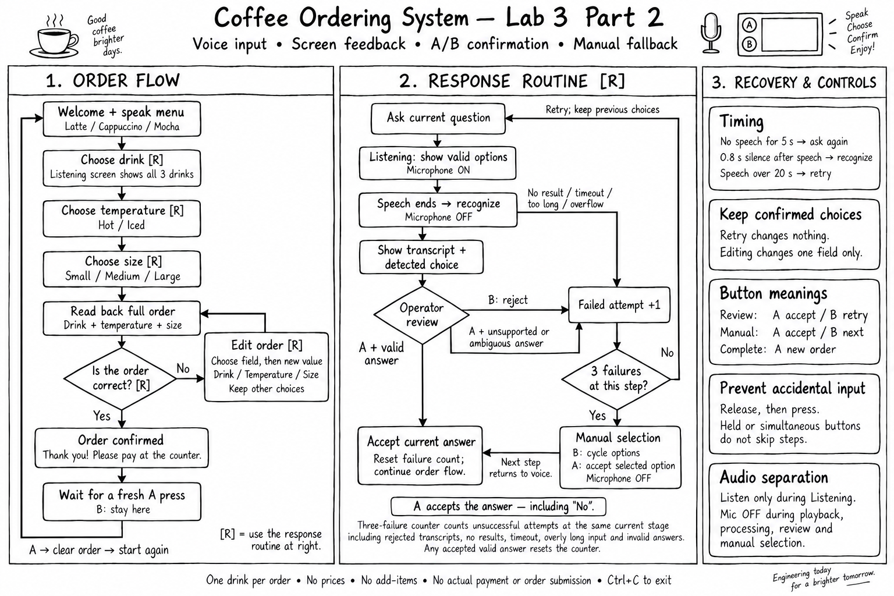
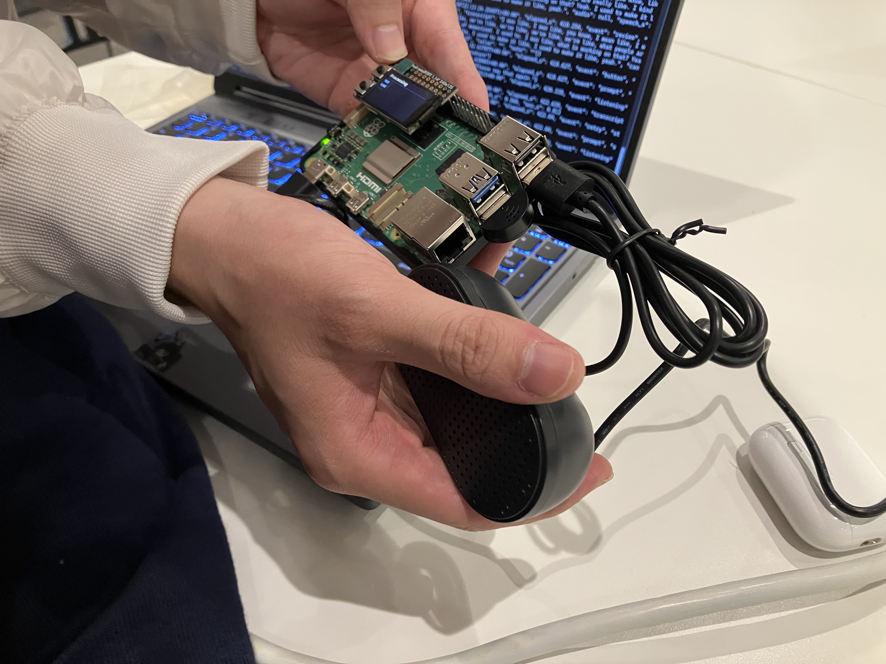
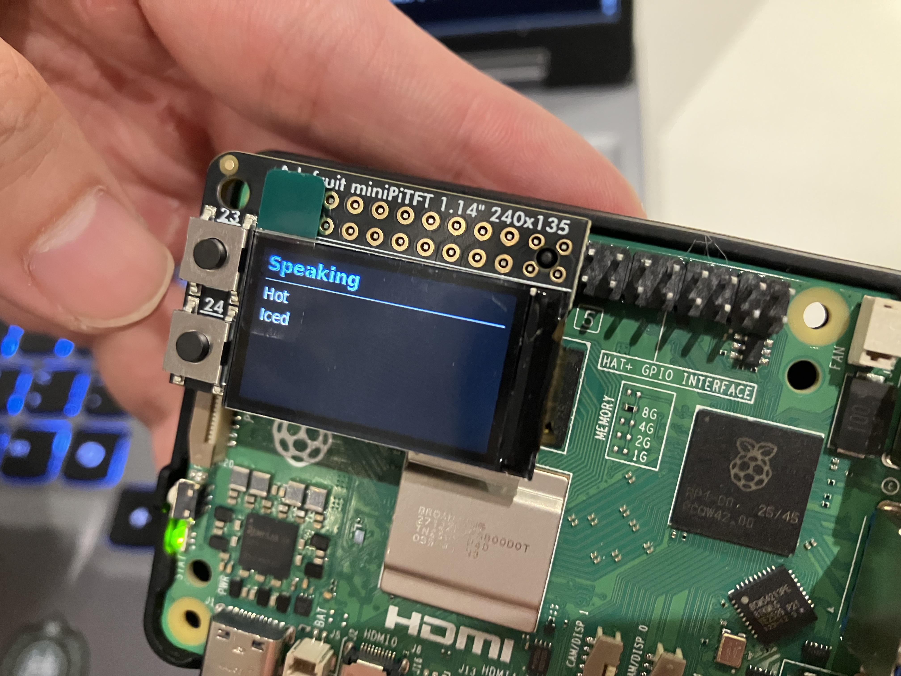

# Chatterboxes

Matthias Corkran, Xie Li

A speech-enabled coffee-ordering device: it greets the customer, takes a drink, temperature and size by voice, and reads the order back for confirmation.

---

# Part 1

## A. Text to Speech

My personalized Piper greeting script: [greet.sh](https://github.com/xl2323-sudo/Interactive-Lab-Hub/blob/Fall2026/Lab%203/speech-scripts/greet.sh)

The words are the same, but the greeting feels different depending on the voice. eSpeak talked the fastest, Festival sounded the most robotic, and Piper sounded the most natural to me. For example, “Welcome back” in Festival felt like an automatic announcement, while in Piper it felt more like someone was actually welcoming me. That’s why I picked Piper for my greeting script.

## B. Speech to Text

I got a real-time factor of 0.23 with tiny.en and 0.43 with base.en. Base.en took almost twice as long without noticeably improving the result, so for this recording, I’d stick with tiny.en for a faster reply.

My script asks how many pets the user has, records the answer, and transcribes it. I tested it with “Two,” which it recognized correctly.

Script: [ask_number.sh](https://github.com/xl2323-sudo/Interactive-Lab-Hub/blob/Fall2026/Lab%203/speech-scripts/ask_number.sh)

## C. Turn-taking

At 0.2s, it felt impatient: pauses while thinking or correcting myself split my sentences. At 0.4s, it was more forgiving but still cut some sentences apart. At 1.5s, it felt slow to respond and even combined my dinner and weather sentences into one turn.

### The complete loop

The bot heard me correctly and repeated my words. Processing took about 1.33 seconds, plus the 0.4-second pause used to detect that I had finished speaking.

## D. Storyboard

I started with a simple coffee order and broke it into drink, temperature, size, and confirmation. I included a change from medium to large to show why pauses matter. Then I used a storyboard and flowchart to map the interaction, choosing a 0.8-second silence threshold to allow short pauses.

## E. Acting out the dialogue

Recording of our role-play: [part_e_roleplay.mp4](part_e_roleplay.mp4)

In this role-play, the customer asked to add extras before choosing a size. I hadn’t included that in my script, so the conversation took an extra turn. I would add a short add-ons and maybe price explanation to make ordering easier.

---

# Lab 3 Part 2

For Part 2 we turned the coffee-order dialogue from Part 1 into a working prototype on the Pi. It uses the webcam mic, a speaker, and the miniPiTFT screen and buttons. We kept a human "wizard" in the loop to check each answer before the system acts on it.

## Prep for Part 2

**1. What could be improved from Part 1?**

- **Wording:** In the Part E role-play the customer asked about add-ons and price before picking a size, and the script had no answer for that. The prompts now list every valid option up front ("We have Latte, Cappuccino, and Mocha…"), and when someone asks about price, the system says prices aren't part of the prototype and repeats the question instead of getting stuck.
- **Timing:** We kept the 0.8 s end-of-turn silence from the storyboard. If nobody speaks within 5 s, the system asks "Would you like more time?" instead of waiting forever. Answers longer than 20 s are rejected.
- **Misunderstandings:** Answers are matched against the valid options for the current step. The system asks again when it hears more than one option ("hot or iced"), a negation ("not a large"), or more than one drink. An explicit correction ("medium, actually large") keeps the corrected choice. After 3 failed attempts it switches to picking with the buttons.

**2. Other modes beyond speech:** The screen always shows what state the device is in, color-coded: **Listening** (green), **Processing** (yellow), **Speaking** (blue). It also lists the options you can say for the current step, so the user doesn't have to remember them. The mic is closed whenever the device is speaking, so the device never hears its own voice.

**3. New dialogue flow:**

## Prototype your system

Code: [`coffee-order/`](coffee-order/) ([`coffee_order.py`](coffee-order/coffee_order.py), run with `bash coffee-order/run_coffee.sh`; add `--simulate` to try it on a laptop without the Pi).

**How it works**

| Stage | What happens |
|---|---|
| Speak | Piper (`en_US-lessac-medium`) reads the prompt; screen shows **Speaking** |
| Listen | Mic stream opens; Silero VAD waits for speech, ends the turn after 0.8 s of silence; screen shows **Listening** |
| Transcribe | faster-whisper `tiny.en` turns the audio into text; screen shows **Processing** |
| Interpret | Keyword rules map the transcript to one option for the current step (or flag it as unclear) |
| Wizard check | Screen shows the transcript and the interpreted choice. **A** accepts, **B** makes the customer repeat |
| Log | Every prompt, transcript, button press and timing is written to `runs/<timestamp>/events.jsonl` |

**Sensors / inputs:** USB webcam microphone (speech), the two miniPiTFT buttons (wizard controls, and manual selection as a fallback).
**Outputs:** speaker (Piper TTS), 240×135 miniPiTFT (status + options + transcript).

*The system mid-order. The screen shows **Processing**, and the laptop behind it streams the JSON event log.*

*While the system asks the temperature question, the screen shows **Speaking** and the two valid answers, Hot and Iced.*

**Controller:** The controller is the two buttons next to the screen. After every answer, the wizard sees what Whisper heard and how the system interpreted it. The wizard presses A to accept or B to have the customer say it again. Nothing counts toward the order until A is pressed.

## Test the system

We tested with classmates (Rohil, Andi, Tony, Gabbi, Edmond, Jacey). Their notes:

- **Rohil & Andi:** match what it hears to one of the answer options, and have it *expect* those words while listening. Work on handling accents better so it doesn't only work for some voices.
- **Tony:** not very sensitive, so you have to repeat yourself several times. The waits on the size and temperature steps are too long. Overall quite good.
- **Gabbi, Edmond & Jacey:** it wasn't getting Gabbi's words right; the model needs more training.

### What worked well about the system and what didn't?
The status on the screen worked well. It was very easy to tell when the system was listening, and showing the options meant people knew what to say. What didn't work was the timing, which felt slow, especially on the short temperature and size steps. It also often misheard non-native English speakers, so they had to repeat themselves.

### What worked well about the controller and what didn't?
Showing the wizard both the raw transcript and the interpreted choice made it easy to catch mishearings before they got into the order. The switch to button selection after 3 failures meant an order could always be finished. The downside is that every turn waits on a button press. That adds to the slowness testers noticed, and it gets tiring when the recognizer keeps missing a speaker.

### What lessons can you take away from the WoZ interactions for designing a more autonomous version of the system?
Study real conversations more closely, especially timing and overlap. Short answers like "iced" or "large" don't need the same wait as an open-ended question, so the end-of-turn silence should depend on the step. Set expectations early in the conversation so people know what the device can handle. We already match transcripts to a fixed set of options, but that only helps if Whisper gets the word right. The next step is to give the recognizer the expected words while it listens (e.g. faster-whisper's `initial_prompt` / `hotwords`) and try a larger or multilingual model so it handles accents better. That would make the wizard's A/B check unnecessary for most turns.

### How could you use your system to create a dataset of interaction? What other sensing modalities would make sense to capture?
The system already logs every turn: the prompt, the transcript, how it was interpreted, the wizard's A/B decision, and timings. With `--save-audio` it also saves each answer as a WAV. Every B press is a labeled example of a mishearing, which is exactly the data needed to improve recognition. A dataset like this could be useful for beginner language-learning apps, customer-service phone lines, or drive-thru ordering. For more modalities, a camera could watch lip movement and nods to tell when someone is about to speak or has finished, which would help with turn-taking and anticipating the conversation.
